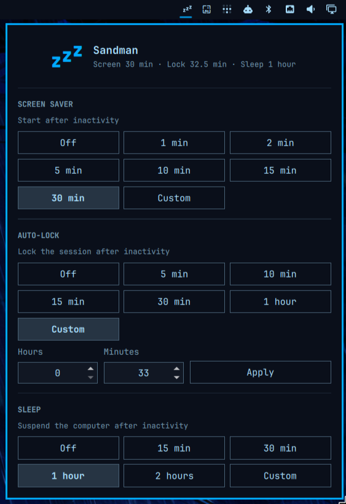

# Sandman

Set when your screen rests, locks, and sleeps from the Omarchy Quattro bar.



Sandman provides three simple controls:

- **Screen saver** — starts the screen saver after the selected period of inactivity.
- **Auto-lock** — locks the session after the selected period of inactivity.
- **Sleep** — suspends the computer after the selected period of inactivity while respecting idle inhibitors.

Each setting offers presets, Off, and a custom hours-and-minutes timeout. Omarchy requires positive screen-saver and lock values, so Sandman simulates Off with safe seven-day timeouts while displaying and persisting Off as `0`.

## Install

```sh
omarchy plugin add https://github.com/lgse/sandman.git --enable
```

If needed, add it to the bar explicitly:

```sh
omarchy bar plugin add lgse.sandman --section right
```

## Usage

Click the Zzz icon in the bar and choose a timeout for each stage. Presets apply immediately; Custom accepts hours and minutes and applies on confirmation for screen saver, auto-lock, and sleep. Existing values that do not match a preset—including Omarchy's 2½-minute screen-saver default—open as Custom. Changes survive shell reloads and reboots.

Sandman stores its state in `~/.config/omarchy/sandman.json`. The effective screen-saver and auto-lock values remain in Omarchy's standard `~/.config/omarchy/shell.json`.

## How sleep works

Sandman uses Quickshell's idle monitor with inhibitor support and requests suspend through `systemctl suspend`. Applications holding an idle inhibitor can prevent the timer from firing, and system-level sleep inhibitors can reject the suspend request.

## Requirements

- Omarchy Quattro
- Python 3
- systemd

## Validate

```sh
npm test
omarchy plugin validate .
qmllint -I "$OMARCHY_PATH/shell" BarWidget.qml Panel.qml Service.qml
```

## Remove

```sh
omarchy plugin remove lgse.sandman
rm -f ~/.config/omarchy/sandman.json
```

Removing Sandman does not revert the screen-saver and lock timeouts already written to `shell.json`.

## License

MIT
