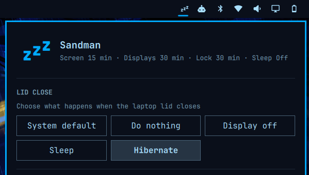

# Sandman

Set when your screen rests, locks, and sleeps from the Omarchy Quattro bar.


On laptops, Sandman also shows lid-close actions:



Sandman provides six simple controls:

- **Lid close** — keeps the system default or does nothing, turns off the laptop display, suspends, or hibernates when the lid closes.
- **Screen saver** — starts the screen saver after the selected period of inactivity.
- **Displays off** — turns the displays off (DPMS) after the selected period of inactivity while respecting idle inhibitors.
- **Auto-lock** — locks the session after the selected period of inactivity.
- **Sleep** — suspends the computer after the selected period of inactivity while respecting idle inhibitors.
- **Hibernate after sleep** — wakes a suspended computer after the selected delay and hibernates it.

Each setting offers presets, Off, and a custom hours-and-minutes timeout. Omarchy requires positive screen-saver and lock values, so Sandman simulates Off with safe seven-day timeouts while displaying and persisting Off as `0`.

## Install

```sh
omarchy plugin add https://github.com/lgse/sandman.git --enable
```

If needed, add it to the bar explicitly:

```sh
omarchy bar plugin add lgse.sandman --section right
```

## Usage

Click the Zzz icon in the bar and choose a lid-close action or a timeout for each idle stage. Presets apply immediately; Custom accepts hours and minutes and applies on confirmation for screen saver, displays off, auto-lock, sleep, and hibernate-after-sleep. Existing values that do not match a preset—including Omarchy's 2½-minute screen-saver default—open as Custom. Changes survive shell reloads and reboots.

The lid controls appear only when UPower reports a laptop lid. **System default** leaves logind in charge. The other actions use a low-level lid-switch inhibitor while Sandman is running, then handle the event without changing system-wide logind configuration. For managed lid actions, Sandman also installs a small managed block in `~/.config/hypr/bindings.lua` that replaces Omarchy's default `switch:on:Lid Switch` binding. Omarchy's default binding locks immediately on lid close, before Sandman can apply **Do nothing** or **Display off**, so Sandman unbinds it and keeps only Omarchy's clamshell monitor reconciliation. Selecting **System default** removes Sandman's managed Hyprland block again. **Display off** targets the internal eDP/LVDS/DSI output and turns it back on when the lid opens. Hibernate is selectable only when logind reports that it is available.

Sandman stores its state in `~/.config/omarchy/sandman.json`. The effective screen-saver and auto-lock values remain in Omarchy's standard `~/.config/omarchy/shell.json`; lid actions and the displays-off, sleep, and hibernate-after-sleep timers are handled by Sandman itself and are not written there. Changing the hibernate delay asks for administrator authorization because systemd's RTC wake timer is configured system-wide.

## How displays off works

Sandman uses Quickshell's idle monitor with inhibitor support and turns the displays off through Hyprland's `dpms` dispatcher. Applications holding an idle inhibitor can prevent the timer from firing, and any key press or mouse movement turns the displays back on.

## How sleep and hibernate work

Sandman uses Quickshell's idle monitor with inhibitor support and requests suspend through `systemctl suspend`. Applications holding an idle inhibitor can prevent the timer from firing, and system-level sleep inhibitors can reject the suspend request.

When **Hibernate after sleep** is enabled, Sandman instead requests `systemctl suspend-then-hibernate`. systemd sets an RTC wake alarm, wakes after the chosen delay, and hibernates. Sandman stores the delay in `/etc/systemd/sleep.conf.d/90-sandman.conf`; changing or disabling it requires administrator authorization. The option is available only when logind reports that suspend-then-hibernate is supported. When it is unavailable, Sandman disables the positive timeout choices and reports any prerequisite it can detect, including missing disk-backed swap, missing kernel hibernation support, missing resume discovery, or restrictive kernel lockdown. **Off** remains available so an old setting can always be cleared.

## Requirements

- Omarchy Quattro
- Python 3
- systemd
- UPower
- GLib (`gdbus`)
- Polkit (`pkexec`), to change the systemd hibernate delay

## Validate

```sh
npm test
omarchy plugin validate .
qmllint -I "$OMARCHY_PATH/shell" BarWidget.qml Panel.qml Service.qml LidService.qml
```

## Remove

```sh
omarchy plugin remove lgse.sandman
rm -f ~/.config/omarchy/sandman.json
sudo rm -f /etc/systemd/sleep.conf.d/90-sandman.conf
```

Removing Sandman does not revert the screen-saver and lock timeouts already written to `shell.json`. If Sandman is removed while a managed lid action is selected, remove the managed block between `-- BEGIN Sandman lid action override` and `-- END Sandman lid action override` from `~/.config/hypr/bindings.lua`, or reinstall Sandman and select **System default** before removing it.

This matters if either setting was left **Off**. Off is stored in `shell.json` as a
seven-day timeout, so removing Sandman while auto-lock is Off leaves a machine that
effectively never locks, with no Sandman UI left to notice it. Set anything you want
back on *before* removing, or restore Omarchy's defaults afterwards:

```sh
python3 - <<'PY'
import json, pathlib
path = pathlib.Path.home() / ".config/omarchy/shell.json"
config = json.loads(path.read_text())
config.setdefault("idle", {}).update({"screensaver": 150, "lock": 300})
path.write_text(json.dumps(config, indent=2) + "\n")
PY
```

## License

MIT
